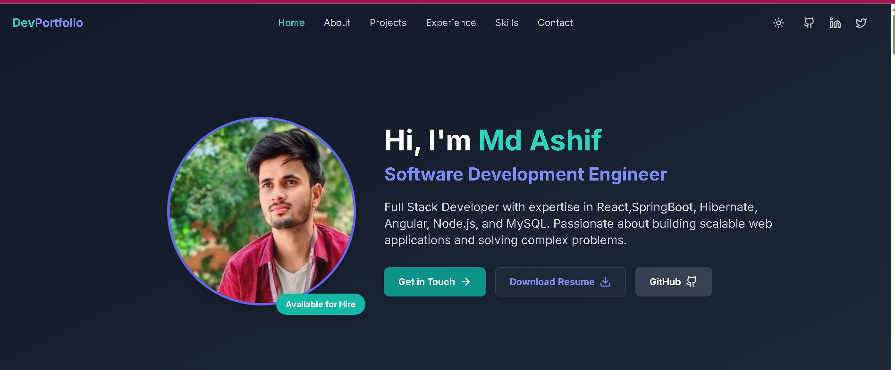

# Developer Portfolio



A modern, responsive developer portfolio built with React, TypeScript, and Tailwind CSS.

## 🌟 Live Demo

[View Live Demo](https://ashif-portfolio.vercel.app)

## ✨ Features

- 🌓 Light/Dark mode toggle
- 📱 Fully responsive design
- 🎯 Smooth scrolling navigation
- 🚀 Optimized performance
- 💼 Project showcase with filtering
- 📊 Skills visualization
- 📝 Contact form with validation
- 📈 Experience timeline

## 🛠️ Built With

<p align="center">
  
  
  
  
  
</p>


## 🚀 Getting Started

### Prerequisites

- Node.js (v14 or later)
- npm or yarn

### Installation

1. Clone the repository
   ```bash
   git clone https://github.com/Asif12as/My-Portfolio.git


2.  Install dependencies

cd developer-portfolio
npm install
# or
yarn

3.  Start the development server

npm run dev
# or
yarn dev
Open http://localhost:5173 in your browser

## 📊 Performance

The portfolio is optimized for performance with:

- Code splitting and lazy loading
- Image optimization
- Efficient re-rendering with React
- Minimized bundle size
- Server-side rendering ready

## 🔥 Key Features In Detail

### Dynamic Project Showcase

The project section features a filterable gallery that showcases my work with detailed descriptions, technologies used, and links to the GitHub repositories and live demos.

### Interactive Skill Visualization

The skills section presents my technical abilities through interactive visual components, making it easy for visitors to understand my expertise at a glance.

### Experience Timeline

A chronological display of my professional journey with detailed descriptions of roles, responsibilities, and technologies used.

### Theme Toggle

Users can switch between light and dark modes based on their preference, with the selection persisted across sessions.

## 🔧 Customization

To use this portfolio for yourself:

1. Update the data files in `src/data/` with your information
2. Replace images in `src/assets/` with your own
3. Modify theme colors in `tailwind.config.js` to match your personal brand
4. Update metadata in `index.html` and other SEO-related information

## 📫 Contact

- GitHub: [@Asif12as](https://github.com/Asif12as)
- LinkedIn: [Md Ashif](https://www.linkedin.com/in/ashif-49039b207/)
- Email: mda957947@gmail.com

## 📄 License

This project is open source and available under the [MIT License](LICENSE).
